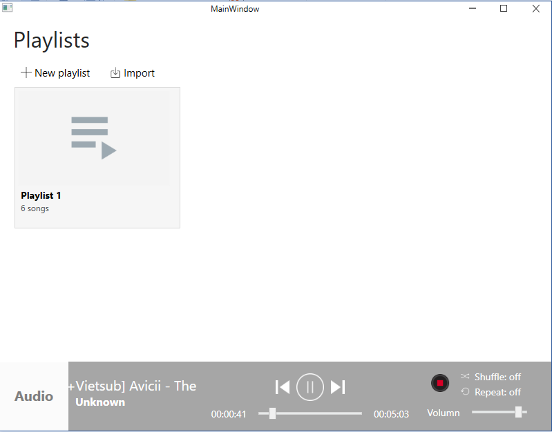
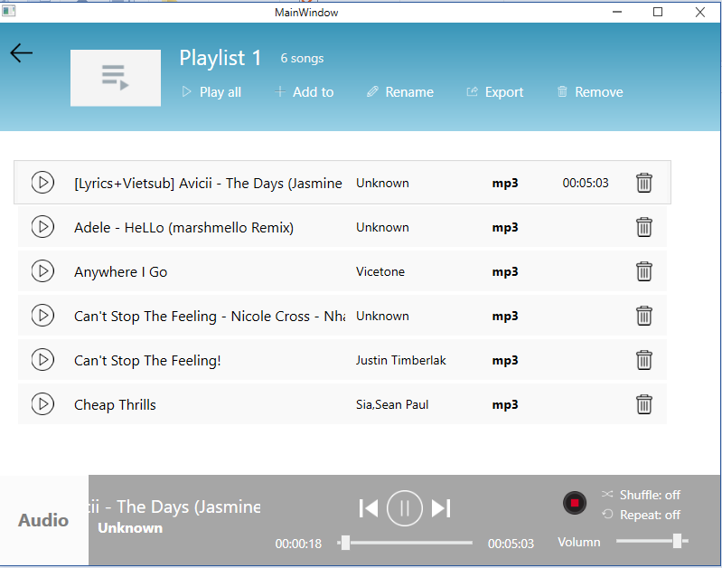

Xây dựng áp Multimedia player

Danh sách chức năng:
+ Tạo ra playlist trống và thêm tập tin đa phương tiện vào 

+ Chọn một tập tin để play 

+ Hiển thị progress của tập tin đang chơi (từ 0:0 đến tổng thời gian của tập tin, ví dụ 5:30) 

+ Tạm dừng / Chơi tiếp một tập tin 

+ Chấm dứt việc chơi một tập tin 

+ Bỏ một / nhiều tập tin ra khỏi playlist. 

+ Chơi playlist theo chế độ tuần tự hoặc ngẫu nhiên

+ Chơi playlist theo chế độ lặp 1 lần hoặc lặp vô tận 

+ Lưu playlist lại (có thể chọn lưu dạng tập tin text hoặc xml) 

+ Nạp lại playlist từ tập tin đã lưu 

+ Lưu và nạp lại các thông tin sau khi chương trình chạy lên:

-	Danh sách playlist chơi lần cuối

-	Tập tin của playlist lần cuối đang chơi để người dùng bắt đầu chơi tiếp	

+ Hook bàn phím để ra lệnh chơi / tạm dừng, kế tiếp, trước đó. 

